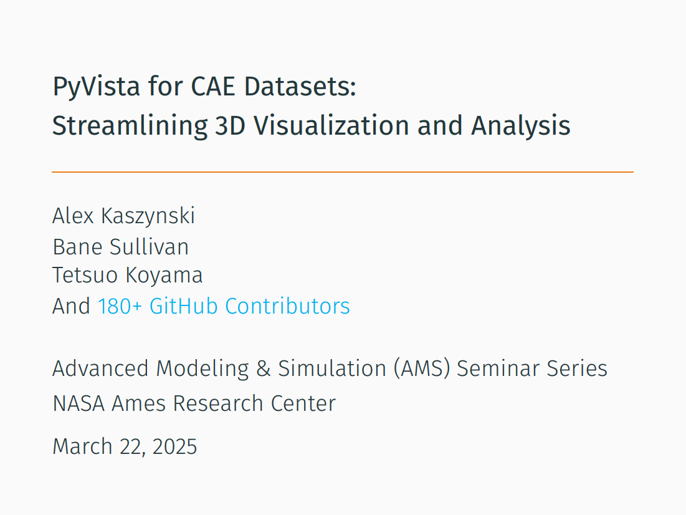

## NASA 2025 Seminar - PyVista: Visualizing CAE and Results with Python

This repository contains the content for the [PyVista - Visualizing CAE and
Results with Python](https://www.nas.nasa.gov/pubs/ams/2025/03-20-25.html) for a NASA seminar at the [NASA Ames Research Center](https://www.nasa.gov/ames/).

Please visit the [PyVista Tutorial](https://tutorial.pyvista.org/) for more details.

### View the Presentation

Visit [nasa_pyvista_seminar_2025.pdf](nasa_pyvista_seminar_2025.pdf) to see the full generated presentation.

[](nasa_pyvista_seminar_2025.pdf)

## Build it Yourself

Due to the usage of ttf fonts, this template requires [LuaTeX](https://www.luatex.org/).

On Linux (Debian) install with:

```
sudo apt update
sudo apt install -y latexmk texlive-luatex texlive-fonts-extra
```

On Windows, use a distribution like [MiKTeX](http://miktex.org/). See [Get LaTeX](https://www.latex-project.org/get/).

### Build

Clone this repository with:
```
git clone https://github.com/akaszynski/pyvista-nasa-ames-presentation
cd pyvista-nasa-ames-presentation
```

Build with:

```
make
```

This will output `nasa_pyvista_seminar_2025.pdf` in the `build` directory.
